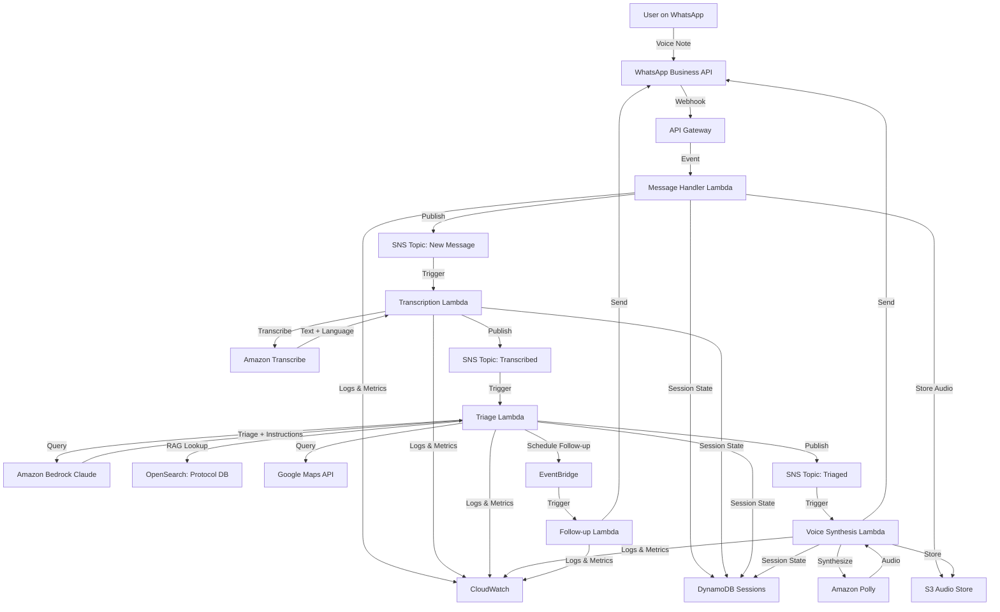

# Design Document: PehliMadad

## Overview

PehliMadad is a voice-first, WhatsApp-based AI health emergency triage system designed for rural India. The system operates as a serverless, event-driven architecture on AWS, processing voice messages through a pipeline of transcription, medical reasoning, and voice synthesis to provide rapid triage guidance in the user's native language.

The architecture prioritizes:
- **Speed**: Sub-15 second end-to-end response time
- **Reliability**: Graceful degradation when components fail
- **Safety**: Conservative triage with protocol-grounded responses
- **Accessibility**: Voice-first interface supporting 10 Indian languages
- **Scalability**: Serverless design to handle variable load

## Architecture

### High-Level Architecture



### Component Responsibilities

**WhatsApp Business API Integration**
- Receives incoming voice messages via webhook
- Sends outgoing voice messages to users
- Handles message delivery status callbacks

**Message Handler Lambda**
- Validates incoming webhook requests
- Downloads voice note from WhatsApp
- Stores audio in S3 with metadata
- Creates or updates session in DynamoDB
- Publishes event to transcription pipeline

**Transcription Lambda**
- Retrieves audio from S3
- Calls Amazon Transcribe with auto language detection
- Handles transcription failures and retries
- Stores transcription in DynamoDB session
- Publishes event to triage pipeline

**Triage Lambda**
- Retrieves transcription and session context
- Performs RAG lookup against protocol database in OpenSearch
- Calls Amazon Bedrock (Claude) for medical reasoning
- Classifies urgency (RED/YELLOW/GREEN)
- Generates first-aid instructions
- Queries Google Maps API for facility routing
- Stores triage results in DynamoDB
- Schedules follow-up via EventBridge (if RED/YELLOW)
- Publishes event to voice synthesis pipeline

**Voice Synthesis Lambda**
- Retrieves triage results from DynamoDB
- Formats response text for voice delivery
- Calls Amazon Polly for text-to-speech
- Stores synthesized audio in S3
- Sends voice message via WhatsApp API
- Updates session with completion status

**Follow-up Lambda**
- Triggered by EventBridge scheduled events
- Retrieves session context from DynamoDB
- Generates follow-up message based on urgency
- Sends follow-up voice message via WhatsApp

### Data Flow

1. **Ingestion**: User sends voice note → WhatsApp webhook → API Gateway → Message Handler
2. **Storage**: Audio stored in S3, session created in DynamoDB
3. **Transcription**: Audio transcribed with language detection
4. **Triage**: Transcription + protocol RAG → Bedrock reasoning → urgency + instructions
5. **Routing**: User location + urgency → Google Maps → nearest facility
6. **Synthesis**: Response text + language → Polly → voice audio
7. **Delivery**: Voice audio → WhatsApp → User
8. **Follow-up**: EventBridge schedule → Follow-up check → WhatsApp

## Components and Interfaces

### WhatsApp Gateway Service

**Responsibilities:**
- Webhook endpoint for WhatsApp Business API
- Message sending via WhatsApp Cloud API
- Signature verification for security
- Rate limiting and retry logic

**Interface:**
```typescript
interface WhatsAppGateway {
  // Receive incoming message webhook
  handleIncomingMessage(webhook: WhatsAppWebhook): Promise<void>
  
  // Send voice message to user
  sendVoiceMessage(phoneNumber: string, audioUrl: string): Promise<MessageStatus>
  
  // Send text message (fallback)
  sendTextMessage(phoneNumber: string, text: string): Promise<MessageStatus>
  
  // Download media from WhatsApp
  downloadMedia(mediaId: string): Promise<Buffer>
  
  // Verify webhook signature
  verifySignature(payload: string, signature: string): boolean
}

interface WhatsAppWebhook {
  object: string
  entry: Array<{
    id: string
    changes: Array<{
      value: {
        messaging_product: string
        metadata: { phone_number_id: string }
        messages?: Array<WhatsAppMessage>
        statuses?: Array<MessageStatus>
      }
    }>
  }>
}

interface WhatsAppMessage {
  from: string
  id: string
  timestamp: string
  type: 'audio' | 'text' | 'image' | 'video' | 'location'
  audio?: {
    id: string
    mime_type: string
  }
  text?: {
    body: string
  }
  location?: {
    latitude: number
    longitude: number
  }
}

interface MessageStatus {
  id: string
  status: 'sent' | 'delivered' | 'read' | 'failed'
  timestamp: string
  error?: {
    code: number
    message: string
  }
}
```

### Transcription Service

**Responsibilities:**
- Audio format conversion if needed
- Language detection across 10 Indian languages
- Speech-to-text transcription
- Confidence scoring
- Error handling for poor audio quality

**Interface:**
```typescript
interface TranscriptionService {
  // Transcribe audio with auto language detection
  transcribe(audioUrl: string): Promise<TranscriptionResult>
  
  // Get supported languages
  getSupportedLanguages(): Array<LanguageCode>
}

interface TranscriptionResult {
  text: string
  language: LanguageCode
  confidence: number
  duration: number
  error?: TranscriptionError
}

type LanguageCode = 'hi-IN' | 'bn-IN' | 'ta-IN' | 'te-IN' | 'mr-IN' | 
                    'gu-IN' | 'kn-IN' | 'ml-IN' | 'pa-IN' | 'en-IN'

interface TranscriptionError {
  code: 'POOR_AUDIO_QUALITY' | 'UNSUPPORTED_LANGUAGE' | 'SERVICE_ERROR'
  message: string
  retryable: boolean
}
```

### Medical Reasoning Engine

**Responsibilities:**
- RAG-based protocol retrieval from OpenSearch
- Prompt construction with context
- Bedrock API interaction (Claude model)
- Urgency classification logic
- First-aid instruction generation
- Medical myth detection and correction
- Safety guardrails enforcement

**Interface:**
```typescript
interface MedicalReasoningEngine {
  // Perform triage on symptoms
  triage(input: TriageInput): Promise<TriageResult>
  
  // Retrieve relevant protocols
  retrieveProtocols(symptoms: string, language: LanguageCode): Promise<Array<Protocol>>
  
  // Validate response safety
  validateResponse(response: TriageResult): ValidationResult
}

interface TriageInput {
  transcription: string
  language: LanguageCode
  sessionContext?: SessionContext
  userLocation?: Location
}

interface TriageResult {
  urgency: 'RED' | 'YELLOW' | 'GREEN'
  reasoning: string
  firstAidInstructions: Array<string>
  warnings: Array<string>
  mythCorrections: Array<MythCorrection>
  disclaimer: string
  confidence: number
}

interface Protocol {
  id: string
  title: string
  source: 'WHO' | 'ICMR'
  content: string
  relevanceScore: number
}

interface MythCorrection {
  myth: string
  correction: string
  source: string
}

interface ValidationResult {
  isValid: boolean
  violations: Array<{
    rule: string
    severity: 'ERROR' | 'WARNING'
    message: string
  }>
}
```

### Facility Locator Service

**Responsibilities:**
- Google Maps API integration
- Facility database management
- Distance and travel time calculation
- Facility type matching to urgency level
- Fallback handling when no facilities found

**Interface:**
```typescript
interface FacilityLocator {
  // Find nearest appropriate facility
  findNearestFacility(location: Location, urgency: UrgencyLevel): Promise<FacilityResult>
  
  // Get multiple nearby facilities
  findNearbyFacilities(location: Location, radius: number): Promise<Array<Facility>>
  
  // Get directions to facility
  getDirections(from: Location, to: Location): Promise<Directions>
}

interface Location {
  latitude: number
  longitude: number
}

type UrgencyLevel = 'RED' | 'YELLOW' | 'GREEN'

interface FacilityResult {
  facility: Facility
  distance: number // in kilometers
  travelTime: number // in minutes
  directions: Directions
}

interface Facility {
  id: string
  name: string
  type: 'HOSPITAL_EMERGENCY' | 'HOSPITAL' | 'CLINIC' | 'PRIMARY_HEALTH_CENTER'
  location: Location
  phone?: string
  capabilities: Array<string>
}

interface Directions {
  url: string // Google Maps link
  steps: Array<string>
  distance: number
  duration: number
}
```

### Voice Synthesis Service

**Responsibilities:**
- Text-to-speech conversion using Amazon Polly
- Language-specific voice selection
- Speaking rate optimization for medical content
- Audio format handling for WhatsApp
- Message splitting for long content

**Interface:**
```typescript
interface VoiceSynthesisService {
  // Synthesize text to speech
  synthesize(input: SynthesisInput): Promise<SynthesisResult>
  
  // Get available voices for language
  getVoicesForLanguage(language: LanguageCode): Array<VoiceInfo>
  
  // Split long text into multiple messages
  splitForSynthesis(text: string, maxDuration: number): Array<string>
}

interface SynthesisInput {
  text: string
  language: LanguageCode
  speakingRate?: number // 0.5 to 2.0, default 0.85 for medical content
  voice?: string
}

interface SynthesisResult {
  audioUrl: string
  duration: number
  format: 'mp3' | 'ogg'
  size: number
}

interface VoiceInfo {
  id: string
  name: string
  language: LanguageCode
  gender: 'MALE' | 'FEMALE'
  neural: boolean
}
```

### Session Manager

**Responsibilities:**
- DynamoDB session CRUD operations
- Session state management
- Conversation history tracking
- Session expiration handling
- User anonymization

**Interface:**
```typescript
interface SessionManager {
  // Create new session
  createSession(phoneNumber: string): Promise<Session>
  
  // Get existing session
  getSession(sessionId: string): Promise<Session | null>
  
  // Update session with new data
  updateSession(sessionId: string, updates: Partial<SessionData>): Promise<Session>
  
  // Archive old session
  archiveSession(sessionId: string): Promise<void>
  
  // Get active sessions for user
  getUserSessions(phoneNumber: string): Promise<Array<Session>>
}

interface Session {
  sessionId: string
  userId: string // anonymized
  phoneNumber: string // hashed
  createdAt: string
  updatedAt: string
  expiresAt: string
  data: SessionData
}

interface SessionData {
  messages: Array<MessageRecord>
  currentState: SessionState
  language?: LanguageCode
  location?: Location
  lastUrgency?: UrgencyLevel
  followUpScheduled?: boolean
}

interface MessageRecord {
  timestamp: string
  direction: 'INBOUND' | 'OUTBOUND'
  type: 'VOICE' | 'TEXT'
  audioUrl?: string
  transcription?: string
  triageResult?: TriageResult
}

type SessionState = 'AWAITING_INPUT' | 'PROCESSING' | 'AWAITING_LOCATION' | 
                    'COMPLETED' | 'FOLLOW_UP'
```

### Follow-up Scheduler

**Responsibilities:**
- EventBridge rule creation for follow-ups
- Follow-up message generation
- Schedule management and cancellation
- Follow-up response handling

**Interface:**
```typescript
interface FollowUpScheduler {
  // Schedule follow-up for session
  scheduleFollowUp(sessionId: string, urgency: UrgencyLevel, delay: number): Promise<string>
  
  // Cancel scheduled follow-up
  cancelFollowUp(scheduleId: string): Promise<void>
  
  // Generate follow-up message
  generateFollowUpMessage(session: Session): Promise<FollowUpMessage>
  
  // Handle follow-up response
  handleFollowUpResponse(sessionId: string, response: string): Promise<void>
}

interface FollowUpMessage {
  text: string
  language: LanguageCode
  urgency: UrgencyLevel
}
```

## Data Models

### DynamoDB Schema

**Sessions Table**
```typescript
interface SessionTableItem {
  PK: string // SESSION#{sessionId}
  SK: string // METADATA
  GSI1PK: string // USER#{hashedPhoneNumber}
  GSI1SK: string // TIMESTAMP#{createdAt}
  sessionId: string
  userId: string
  phoneNumberHash: string
  createdAt: string
  updatedAt: string
  expiresAt: number // TTL
  language?: LanguageCode
  location?: Location
  currentState: SessionState
  lastUrgency?: UrgencyLevel
  followUpScheduled?: boolean
}

interface MessageTableItem {
  PK: string // SESSION#{sessionId}
  SK: string // MESSAGE#{timestamp}
  messageId: string
  timestamp: string
  direction: 'INBOUND' | 'OUTBOUND'
  type: 'VOICE' | 'TEXT'
  audioS3Key?: string
  transcription?: string
  language?: LanguageCode
  triageResult?: TriageResult
  synthesisResult?: SynthesisResult
}
```

**Indexes:**
- Primary: PK (partition), SK (sort)
- GSI1: GSI1PK (partition), GSI1SK (sort) - for user session lookup

### S3 Structure

```
pehli-madad-audio/
├── inbound/
│   └── {sessionId}/
│       └── {messageId}.ogg
├── outbound/
│   └── {sessionId}/
│       └── {messageId}.mp3
└── archived/
    └── {year}/
        └── {month}/
            └── {day}/
                └── {sessionId}/
```

### OpenSearch Protocol Database Schema

```typescript
interface ProtocolDocument {
  id: string
  title: string
  source: 'WHO' | 'ICMR'
  category: string
  symptoms: Array<string>
  urgencyIndicators: {
    red: Array<string>
    yellow: Array<string>
    green: Array<string>
  }
  firstAidSteps: Array<string>
  warnings: Array<string>
  mythCorrections: Array<MythCorrection>
  content: string // full protocol text
  embedding: Array<number> // for semantic search
  languages: Array<LanguageCode>
  lastUpdated: string
}
```

## Correctness Properties


A property is a characteristic or behavior that should hold true across all valid executions of a system—essentially, a formal statement about what the system should do. Properties serve as the bridge between human-readable specifications and machine-verifiable correctness guarantees.

### Property Reflection

After analyzing all acceptance criteria, several redundancies were identified:
- Requirements 3.7, 9.1 (no diagnoses) → Combined into single property
- Requirements 4.3, 9.2 (no prescriptions) → Combined into single property  
- Requirements 4.7, 9.3 (disclaimers) → Combined into single property
- Requirements 3.5, 9.5 (conservative classification) → Combined into single property
- Requirements 7.2 and 3.6 (RED response time) → Combined into single property

### Core Properties

**Property 1: Message Acknowledgment Timing**
*For any* voice note sent to the WhatsApp number, the system should acknowledge receipt within 2 seconds.
**Validates: Requirements 1.1**

**Property 2: Audio Storage with Unique Identifiers**
*For any* received voice note, the system should store it in S3 with a unique identifier that can be retrieved later.
**Validates: Requirements 1.2**

**Property 3: Session Continuity**
*For any* sequence of messages from the same user within 24 hours, all messages should be associated with the same session ID.
**Validates: Requirements 1.4, 8.2**

**Property 4: Non-Voice Message Handling**
*For any* non-voice message (text, image, video) sent by a user, the system should respond with a voice message requesting a voice note instead.
**Validates: Requirements 1.5**

**Property 5: Language Detection**
*For any* voice note in a supported language (Hindi, Bengali, Tamil, Telugu, Marathi, Gujarati, Kannada, Malayalam, Punjabi, English), the transcription service should detect the language correctly.
**Validates: Requirements 2.1**

**Property 6: Transcription Output Format**
*For any* successful transcription, the result should include both the transcribed text and the detected language code.
**Validates: Requirements 2.2**

**Property 7: Transcription Storage**
*For any* completed transcription, the session should store both the original audio S3 reference and the transcribed text.
**Validates: Requirements 2.5**

**Property 8: Valid Urgency Classification**
*For any* transcribed symptom description, the medical reasoning engine should classify urgency as exactly one of RED, YELLOW, or GREEN.
**Validates: Requirements 3.1**

**Property 9: Life-Threatening Symptom Classification**
*For any* symptom description containing life-threatening indicators (chest pain, difficulty breathing, severe bleeding, altered consciousness, severe head injury), the system should classify urgency as RED.
**Validates: Requirements 3.2**

**Property 10: Conservative Default Classification**
*For any* ambiguous or incomplete symptom description, the system should default to YELLOW classification and request additional information.
**Validates: Requirements 3.5, 9.5**

**Property 11: RED Response Time Priority**
*For any* case classified as RED urgency, the system should complete end-to-end processing and deliver response within 10 seconds.
**Validates: Requirements 3.6, 7.2**

**Property 12: No Medical Diagnoses**
*For any* system response, the output should not contain medical diagnosis language (e.g., "you have", "this is", "diagnosed with") and should only provide urgency classification and guidance.
**Validates: Requirements 3.7, 9.1**

**Property 13: First-Aid Instructions Presence**
*For any* completed urgency classification, the response should include at least one first-aid instruction.
**Validates: Requirements 4.1**

**Property 14: Protocol-Grounded Instructions**
*For any* first-aid instruction provided, it should be traceable to a WHO or ICMR protocol in the protocol database.
**Validates: Requirements 4.2**

**Property 15: No Prescription Medications**
*For any* system response, the output should not recommend prescription medications by name or class.
**Validates: Requirements 4.3, 9.2**

**Property 16: Medical Myth Correction**
*For any* user input containing known dangerous medical myths (ice on burns, tourniquets for snakebites, etc.), the response should include explicit correction with proper protocol.
**Validates: Requirements 4.4**

**Property 17: Step-by-Step Instruction Format**
*For any* first-aid instructions provided, they should be structured as numbered or sequential steps.
**Validates: Requirements 4.5**

**Property 18: Risk Warnings**
*For any* first-aid instruction involving potential risks (e.g., moving an injured person, applying pressure), the response should include safety warnings.
**Validates: Requirements 4.6**

**Property 19: Disclaimer Presence**
*For any* system response, it should include an explicit disclaimer that this is not medical diagnosis and professional care is needed.
**Validates: Requirements 4.7, 9.3**

**Property 20: Facility Lookup for Urgent Cases**
*For any* case classified as RED or YELLOW with user location available, the system should identify and return the nearest appropriate medical facility.
**Validates: Requirements 5.1**

**Property 21: Location Request When Missing**
*For any* case classified as RED or YELLOW without user location, the system should send a message requesting location sharing.
**Validates: Requirements 5.2**

**Property 22: Facility Type Prioritization**
*For any* facility search with multiple nearby options, the returned facility should match the urgency level (RED → emergency hospital, YELLOW → hospital or clinic, GREEN → primary health center).
**Validates: Requirements 5.3**

**Property 23: Complete Facility Information**
*For any* facility result returned, the response should include facility name, distance in kilometers, and estimated travel time in minutes.
**Validates: Requirements 5.4**

**Property 24: Google Maps Directions**
*For any* facility result returned, the response should include a valid Google Maps URL for navigation.
**Validates: Requirements 5.6**

**Property 25: Language Consistency**
*For any* input voice note in language L, the output voice response should be in the same language L.
**Validates: Requirements 6.1**

**Property 26: Response Audio Storage**
*For any* generated voice response, the audio file should be stored in S3 with a reference to the original query.
**Validates: Requirements 6.4**

**Property 27: End-to-End Response Time**
*For any* voice note received, the system should complete the full pipeline (transcription, triage, synthesis, delivery) within 15 seconds for 95% of requests.
**Validates: Requirements 6.6, 7.1**

**Property 28: Interim Processing Messages**
*For any* request that exceeds 8 seconds of processing time, the system should send an interim "processing" message to the user.
**Validates: Requirements 7.3**

**Property 29: Concurrent Request Processing**
*For any* set of simultaneous requests from different users, the system should process them concurrently without blocking.
**Validates: Requirements 7.4**

**Property 30: New Session Creation**
*For any* first message from a new user, the system should create a new session with a unique session ID.
**Validates: Requirements 8.1**

**Property 31: Follow-Up Scheduling**
*For any* session classified as RED or YELLOW, the system should schedule a follow-up message for 2 hours after the initial response.
**Validates: Requirements 8.3**

**Property 32: Follow-Up Message Delivery**
*For any* scheduled follow-up, the system should send a voice message at the scheduled time asking about the user's status.
**Validates: Requirements 8.4**

**Property 33: Follow-Up Response Handling**
*For any* user response to a follow-up message, the system should update the session with the new information.
**Validates: Requirements 8.5**

**Property 34: Session Archival**
*For any* session with no activity for 48 hours, the system should archive the session and mark it as inactive.
**Validates: Requirements 8.6**

**Property 35: Emergency Service Instructions for RED**
*For any* case classified as RED urgency, the response should explicitly instruct the user to call emergency services (108 in India) immediately.
**Validates: Requirements 9.4**

**Property 36: Most Serious Condition First**
*For any* symptom description that could indicate multiple conditions, the response should address the most serious possibility first.
**Validates: Requirements 9.6**

**Property 37: Interaction Logging**
*For any* user interaction (message received, response sent), the system should create a log entry with timestamp, session ID, and interaction details.
**Validates: Requirements 9.7**

**Property 38: Audio Metadata Storage**
*For any* received voice note, the stored audio should include metadata (timestamp, user identifier, session ID, file size, duration).
**Validates: Requirements 11.1**

**Property 39: Response-Query Linking**
*For any* generated voice response, the stored audio should include a reference linking it to the original query message ID.
**Validates: Requirements 11.2**

**Property 40: Audio Retention Period**
*For any* audio file stored, it should remain accessible for 90 days before archival.
**Validates: Requirements 11.3**

**Property 41: Audio Encryption at Rest**
*For any* audio file stored in S3, it should be encrypted using AES-256 encryption.
**Validates: Requirements 11.5**

**Property 42: Audio Access Logging**
*For any* access to stored audio files, the system should log the access with user identifier and timestamp.
**Validates: Requirements 11.6**

**Property 43: Transcription Failure Handling**
*For any* transcription service failure, the system should respond to the user asking them to resend the voice note with clearer audio.
**Validates: Requirements 12.1**

**Property 44: Voice Synthesis Fallback**
*For any* voice synthesis service failure, the system should send the response as a text message with an apology.
**Validates: Requirements 12.3**

**Property 45: Facility Locator Fallback**
*For any* facility locator service failure, the system should provide general guidance to seek the nearest hospital.
**Validates: Requirements 12.4**

**Property 46: Message Queuing on Connection Loss**
*For any* WhatsApp gateway connection failure, the system should queue outgoing messages for delivery when the connection restores.
**Validates: Requirements 12.5**

**Property 47: Error Logging**
*For any* component error or exception, the system should log detailed error information including component name, error type, timestamp, and stack trace.
**Validates: Requirements 12.6**

**Property 48: Speaking Rate Configuration**
*For any* voice synthesis request, the speaking rate should be set to 0.85 (slower than conversational) for medical instructions.
**Validates: Requirements 13.2**

**Property 49: Medical Term Simplification**
*For any* technical medical term without common translation in the target language, the system should use simple explanatory phrases instead.
**Validates: Requirements 13.4**

**Property 50: PII Minimization**
*For any* data stored in the system, it should not contain personally identifiable information beyond what is necessary for session management (no full names, addresses, or unmasked phone numbers).
**Validates: Requirements 14.1**

**Property 51: User Identifier Anonymization**
*For any* user identifier stored or logged, it should be anonymized using a one-way hash function.
**Validates: Requirements 14.2**

**Property 52: PII Redaction in Transcriptions**
*For any* stored transcription, names, addresses, and other PII should be redacted or replaced with placeholders.
**Validates: Requirements 14.3**

**Property 53: TLS Encryption in Transit**
*For any* network communication between system components, TLS 1.3 or higher should be used.
**Validates: Requirements 14.4**

**Property 54: AES-256 Encryption at Rest**
*For any* data stored in DynamoDB or S3, AES-256 encryption should be enabled.
**Validates: Requirements 14.5**

**Property 55: Data Deletion Compliance**
*For any* user data deletion request, all associated data should be removed from all storage systems within 7 days.
**Validates: Requirements 14.6**

**Property 56: Pipeline Stage Timing Logs**
*For any* request processed, the system should log response time for each pipeline stage (transcription, triage, synthesis, delivery).
**Validates: Requirements 15.1**

**Property 57: Urgency Classification Metrics**
*For any* urgency classification made, the system should increment the appropriate metric counter (RED, YELLOW, or GREEN).
**Validates: Requirements 15.2**

**Property 58: Transcription Confidence Tracking**
*For any* transcription completed, the system should record the confidence score in metrics.
**Validates: Requirements 15.3**

**Property 59: Language Detection Metrics**
*For any* language detection completed, the system should record the detected language in metrics.
**Validates: Requirements 15.4**

**Property 60: Daily Summary Report Generation**
*For any* calendar day, the system should generate a summary report containing usage statistics, error counts, and performance metrics.
**Validates: Requirements 15.6**

**Property 61: Random Sampling for Quality Review**
*For any* request to sample interactions, the system should return a random subset of the specified size from the available interactions.
**Validates: Requirements 15.7**

## Error Handling

### Error Categories

**Transient Errors** (Retry with exponential backoff):
- Transcription service timeouts
- Bedrock API rate limits
- Google Maps API temporary failures
- WhatsApp API delivery failures

**Permanent Errors** (Fallback to degraded service):
- Unsupported audio format
- Corrupted audio file
- Invalid user location
- Service quota exceeded

**Critical Errors** (Alert operators immediately):
- Bedrock service unavailable
- DynamoDB connection failure
- S3 access denied
- WhatsApp webhook authentication failure

### Error Response Patterns

**Transcription Errors:**
```
Poor audio quality → "I couldn't understand the audio clearly. Please send another voice note speaking slowly and clearly."
Unsupported language → "I detected a language I don't support yet. Please try in Hindi, English, or [list other languages]."
```

**Triage Errors:**
```
Bedrock unavailable → "I'm having technical difficulties. Please call 108 for emergency help or visit your nearest hospital."
Ambiguous symptoms → "I need more information. Can you describe: [specific questions]?"
```

**Facility Locator Errors:**
```
No location → "Please share your location so I can find the nearest hospital."
No facilities found → "The nearest facility is [X] km away. Consider calling 108 for emergency transport."
Maps API failure → "I can't get directions right now. Please go to your nearest hospital or call 108."
```

**Voice Synthesis Errors:**
```
Polly unavailable → Send text message: "Technical issue with voice. [text response]. Sorry for the inconvenience."
Audio too large → Split into multiple messages with "Part 1 of 3", "Part 2 of 3", etc.
```

### Retry Logic

**Exponential Backoff Configuration:**
- Initial delay: 100ms
- Maximum delay: 5 seconds
- Maximum retries: 3
- Jitter: ±25% to prevent thundering herd

**Retry Decision Matrix:**
```typescript
interface RetryPolicy {
  transcription: {
    timeout: 3 retries
    rateLimit: 3 retries
    invalidAudio: 0 retries
  }
  bedrock: {
    timeout: 3 retries
    rateLimit: 3 retries with backoff
    validationError: 0 retries
  }
  maps: {
    timeout: 2 retries
    rateLimit: 2 retries
    invalidLocation: 0 retries
  }
  whatsapp: {
    timeout: 5 retries
    rateLimit: 5 retries with backoff
    invalidRecipient: 0 retries
  }
}
```

### Circuit Breaker Pattern

Implement circuit breakers for external services:
- **Closed**: Normal operation, requests pass through
- **Open**: After 5 consecutive failures, reject requests immediately for 30 seconds
- **Half-Open**: After timeout, allow 1 test request to check if service recovered

## Testing Strategy

### Dual Testing Approach

The testing strategy employs both unit tests and property-based tests as complementary approaches:

**Unit Tests** focus on:
- Specific examples of correct behavior
- Edge cases (long audio, missing location, unsupported language)
- Error conditions (service failures, invalid inputs)
- Integration points between components
- Mock external services (WhatsApp, Transcribe, Bedrock, Maps, Polly)

**Property-Based Tests** focus on:
- Universal properties that hold for all inputs
- Comprehensive input coverage through randomization
- Invariants that must be maintained
- Round-trip properties (e.g., session storage and retrieval)
- Safety constraints (no diagnoses, no prescriptions)

### Property-Based Testing Configuration

**Framework**: Use `fast-check` for TypeScript/JavaScript or `hypothesis` for Python

**Configuration**:
- Minimum 100 iterations per property test
- Each test tagged with: `Feature: pehli-madad, Property {N}: {property text}`
- Seed-based reproducibility for failed tests
- Shrinking enabled to find minimal failing examples

**Example Property Test Structure**:
```typescript
import fc from 'fast-check'

// Feature: pehli-madad, Property 8: Valid Urgency Classification
test('urgency classification returns RED, YELLOW, or GREEN', async () => {
  await fc.assert(
    fc.asyncProperty(
      fc.string({ minLength: 10, maxLength: 500 }), // random symptom description
      async (symptoms) => {
        const result = await triageEngine.classify(symptoms)
        expect(['RED', 'YELLOW', 'GREEN']).toContain(result.urgency)
      }
    ),
    { numRuns: 100 }
  )
})

// Feature: pehli-madad, Property 12: No Medical Diagnoses
test('responses never contain diagnostic language', async () => {
  await fc.assert(
    fc.asyncProperty(
      fc.string({ minLength: 10, maxLength: 500 }),
      async (symptoms) => {
        const result = await triageEngine.classify(symptoms)
        const diagnosticPhrases = ['you have', 'diagnosed with', 'this is', 'you are suffering from']
        const response = result.firstAidInstructions.join(' ').toLowerCase()
        
        for (const phrase of diagnosticPhrases) {
          expect(response).not.toContain(phrase)
        }
      }
    ),
    { numRuns: 100 }
  )
})
```

### Test Data Generators

**For Property-Based Tests**, create custom generators:

```typescript
// Generate realistic symptom descriptions
const symptomGenerator = fc.oneof(
  fc.constant('chest pain and difficulty breathing'),
  fc.constant('high fever with rashes'),
  fc.constant('snakebite on leg'),
  fc.constant('severe headache and vomiting'),
  fc.constant('burn on hand from cooking'),
  fc.record({
    symptom: fc.oneof(fc.constant('fever'), fc.constant('pain'), fc.constant('bleeding')),
    location: fc.oneof(fc.constant('chest'), fc.constant('head'), fc.constant('leg')),
    duration: fc.integer({ min: 1, max: 72 })
  }).map(s => `${s.symptom} in ${s.location} for ${s.duration} hours`)
)

// Generate voice notes with various languages
const voiceNoteGenerator = fc.record({
  audioUrl: fc.webUrl(),
  language: fc.constantFrom('hi-IN', 'bn-IN', 'ta-IN', 'te-IN', 'mr-IN', 'gu-IN', 'kn-IN', 'ml-IN', 'pa-IN', 'en-IN'),
  duration: fc.integer({ min: 5, max: 180 }),
  transcription: symptomGenerator
})

// Generate user locations
const locationGenerator = fc.record({
  latitude: fc.double({ min: 8.0, max: 35.0 }), // India bounds
  longitude: fc.double({ min: 68.0, max: 97.0 })
})
```

### Integration Testing

**End-to-End Flow Tests**:
1. Send voice note → Verify acknowledgment within 2 seconds
2. Mock transcription → Verify triage classification
3. Mock facility lookup → Verify response includes facility info
4. Mock voice synthesis → Verify audio delivery
5. Verify session state updated correctly
6. Verify follow-up scheduled for RED/YELLOW

**Component Integration Tests**:
- Message Handler ↔ Session Manager
- Transcription Lambda ↔ Triage Lambda (via SNS)
- Triage Lambda ↔ Voice Synthesis Lambda (via SNS)
- All Lambdas ↔ DynamoDB session storage
- Triage Lambda ↔ OpenSearch protocol database

### Performance Testing

**Load Testing Scenarios**:
- 100 concurrent users sending voice notes
- Burst of 500 requests in 10 seconds
- Sustained load of 50 requests/second for 5 minutes

**Performance Assertions**:
- P95 response time < 15 seconds
- P99 response time < 20 seconds
- RED urgency P95 < 10 seconds
- No request failures under normal load
- Graceful degradation under 2x expected load

### Safety Testing

**Medical Safety Tests**:
- Verify no diagnostic language in 1000 random responses
- Verify no prescription medications in 1000 random responses
- Verify disclaimer present in 100% of responses
- Verify RED cases always include "call 108" instruction
- Verify dangerous myths are corrected when detected

**Security Testing**:
- Verify all stored audio is encrypted
- Verify all PII is redacted from logs
- Verify webhook signature validation
- Verify TLS 1.3 for all external communication
- Verify user identifiers are hashed

### Monitoring and Observability

**CloudWatch Metrics**:
- Request count by urgency level
- Response time by pipeline stage
- Error rate by component
- Language distribution
- Transcription confidence scores

**CloudWatch Alarms**:
- P95 response time > 20 seconds
- Error rate > 5%
- Bedrock API failures > 10/minute
- WhatsApp delivery failures > 5%

**X-Ray Tracing**:
- End-to-end request tracing
- Service map visualization
- Bottleneck identification
- Error path analysis

**Log Aggregation**:
- Structured JSON logs
- Correlation IDs across services
- PII-redacted transcriptions
- Error stack traces
- Performance metrics
