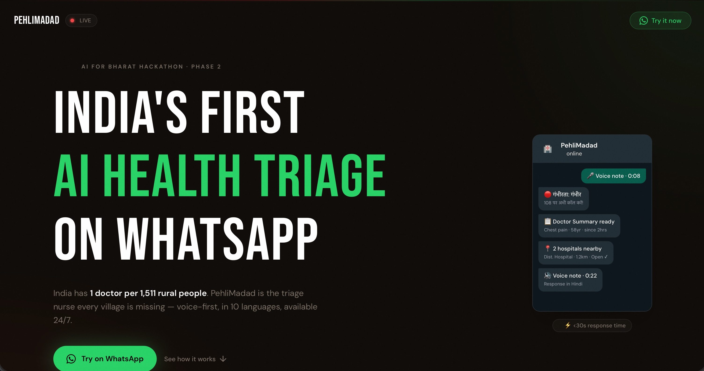

# PehliMadad — India's First AI Health Emergency Triage on WhatsApp

> "India has 1 doctor per 1,511 rural people. PehliMadad is the triage nurse every village is missing."

[](https://pehlimadad.in)
[](https://pehlimadad.in)
[](https://pehlimadad.in)
[](https://pehlimadad.in)

---

PehliMadad (First Help) is Bharat's first voice-first AI health emergency triage system on WhatsApp, powered entirely by AWS. A user sends a voice note or text in any Indian language — within 30 seconds they receive a severity verdict (CRITICAL/URGENT/MODERATE/MILD) spoken back in their language, a doctor-ready clinical summary, and nearby open hospitals with Google Maps links. No app download. No sign-up. No literacy required.

The stack is 100% serverless on AWS: Amazon Bedrock (Nova Pro) powers multilingual medical reasoning, Amazon Transcribe handles voice-to-text with automatic language identification across 10 Indian languages, Amazon Polly and Google WaveNet deliver voice responses, AWS Lambda runs the full async pipeline, DynamoDB maintains conversation context, and AWS Amplify hosts the landing page. Cost: ~₹0.16 per interaction — making public health scale deployment viable for the first time.

This solution cannot be built without Generative AI. No rule-based system can auto-detect 10 Indian languages from a noisy voice note, reason probabilistically about symptoms, maintain multi-turn triage conversations, and respond coherently to colloquial, panicked input. Amazon Bedrock's Nova Pro makes all of this possible in a single serverless call.

*Solo submission · AWS AI for Bharat Hackathon · Phase 2 · 2026*

---

## Try It Now

The bot is live on WhatsApp. No app download, no registration.

1. Open WhatsApp and message **+1 415 523 8886**
2. Send the join code: `join ordinary-upper`
3. Send a voice note or text describing a health emergency in any Indian language

**MVP Link:** https://pehlimadad.in



---

## The Problem

In rural India, the critical gap is not the lack of hospitals — it's the lack of **intelligence before reaching one**.

- **600M+** rural Indians lack timely emergency care
- **80%** of medical emergencies occur before reaching a hospital
- **40 min+** average ambulance wait in rural areas
- **1,511:1** rural patients per doctor (WHO standard: 1,000:1)

---

## The Solution

PehliMadad is a voice-first, WhatsApp-based AI triage system. Send a voice note in any Indian language — get severity assessment, first-aid steps, a doctor-ready clinical summary, and nearby open hospitals. All within 30 seconds. No app. No literacy required.

### User Flow

```
User sends WhatsApp voice note / text
        ↓
Twilio receives message → POST to API Gateway
        ↓
Lambda (webhook) — responds in <1s, triggers async processor
        ↓
Lambda (processor):
  ├── Voice? → S3 upload → Amazon Transcribe (auto language detect)
  ├── Amazon DynamoDB — fetch session context
  ├── Amazon Bedrock (Nova Pro) — triage assessment + doctor summary
  └── Amazon Polly / Google TTS — voice response
        ↓
Twilio → WhatsApp User receives:
  1. Severity + first-aid steps (voice note in their language)
  2. Doctor-ready clinical summary (text)
  3. Nearby open hospitals with Google Maps links (text)
```

---

## Architecture

| Service | Role |
|---|---|
| **Amazon Bedrock (Nova Pro)** | Multi-language health triage, severity classification, clinical summaries |
| **Amazon Transcribe** | OGG voice → text with automatic language identification |
| **Amazon Polly** | Neural TTS — Hindi/English voice responses |
| **AWS Lambda** | Two-function arch: webhook (<1s) + async processor (60s timeout) |
| **Amazon DynamoDB** | Per-user conversation context, 24hr TTL, multi-turn triage flow |
| **Amazon S3** | Temporary audio storage — Transcribe input + Polly output |
| **Amazon API Gateway** | HTTP webhook endpoint, validates Twilio signatures |
| **AWS Amplify** | Hosts the Next.js landing page at pehlimadad.in |
| **Twilio** | WhatsApp sandbox integration |
| **Google Maps API** | Geocoding + nearby hospital lookup |

---

## Language Support

10 Indian languages supported for both voice input and voice output:

| Language | Speakers | TTS Engine |
|---|---|---|
| Hindi | 600M+ | Amazon Polly (Kajal neural) |
| English | 125M+ | Amazon Polly |
| Bengali | 100M+ | Google WaveNet |
| Telugu | 80M+ | Google WaveNet |
| Marathi | 80M+ | Google WaveNet |
| Tamil | 70M+ | Google WaveNet |
| Gujarati | 55M+ | Google WaveNet |
| Kannada | 45M+ | Google WaveNet |
| Malayalam | 35M+ | Google WaveNet |
| Punjabi | 30M+ | Google WaveNet |

> Amazon Polly neural voices currently support Hindi and English for Indian languages. For the remaining 8 regional languages, Google WaveNet TTS is used as a fallback to ensure native-quality voice responses across all supported languages.

---

## Repo Structure

```
pehlimadad/
├── .env.example              # Required environment variables
├── package.json
├── serverless.yml            # Full IaC — Lambda, API Gateway, DynamoDB, S3, IAM
├── src/
│   ├── handler.js            # Lambda webhook entry point (<1s Twilio response)
│   ├── processor.js          # Async pipeline — transcribe → triage → respond
│   ├── bedrock.js            # Amazon Bedrock (Nova Pro) client + triage prompts
│   ├── transcribe.js         # S3 upload + Amazon Transcribe job
│   ├── session.js            # DynamoDB session CRUD
│   ├── whatsapp.js           # Twilio response helpers
│   ├── polly.js              # Amazon Polly TTS
│   ├── geocode.js            # Google Maps geocoding
│   └── locate.js             # Nearby hospital lookup
└── web/                      # Next.js landing page (pehlimadad.in)
    ├── app/
    ├── components/
    ├── public/
    └── amplify.yml
```

---

## Setup & Deployment

### Prerequisites
- AWS account with Amazon Bedrock Nova Pro access enabled
- Twilio account with WhatsApp sandbox configured
- Google Maps API key (Geocoding + Places)
- Node.js 20+

### 1. Clone and install

```bash
git clone https://github.com/souvik21/pehlimadad.git
cd pehlimadad
npm install
```

### 2. Configure environment

```bash
cp .env.example .env
# Fill in your credentials — see .env.example for all required vars
```

### 3. Deploy to AWS

```bash
npx sls deploy
# Outputs the API Gateway URL — set this as your Twilio webhook
```

### 4. Set Twilio webhook

In your Twilio console, set the WhatsApp sandbox webhook URL to:
```
https://<your-api-gateway-url>/webhook
```

### 5. Test

Send `join ordinary-upper` to +1 415 523 8886 on WhatsApp, then send a voice note.

---

## Key Design Decisions

**Why Amazon Bedrock (Nova Pro)?**
No rule-based NLP can auto-detect 10 Indian languages from a noisy voice note and respond with medically coherent, contextual triage. Nova Pro handles language detection, symptom reasoning, severity classification, and clinical summary generation — all in a single prompt invocation.

**Why WhatsApp?**
500M+ Indian users already have it. Zero friction — no app install, no account creation, works on any 2G phone.

**Why voice-first?**
350M+ Indians are functionally illiterate. A voice interface removes the literacy barrier entirely.

**Two-Lambda architecture:**
Twilio requires a webhook response within 15 seconds. The full AI pipeline (Transcribe + Bedrock + Polly) takes 20–40 seconds. The webhook Lambda responds instantly with an acknowledgement; a second async Lambda does the heavy lifting and sends the response via Twilio REST API.

---

## Safety

PehliMadad triages — it does not diagnose.

- All responses include: *"This is not a substitute for professional medical advice. Always call 108 in life-threatening emergencies."*
- The system is calibrated to over-triage (escalate ambiguity to higher severity) to prevent missed emergencies
- No patient data is persisted beyond 24 hours (DynamoDB TTL)

---

## Built With

- Spec-driven development using **[Kiro](https://kiro.dev)**
- Submitted for **AWS AI for Bharat Hackathon · Phase 2 · 2026**
